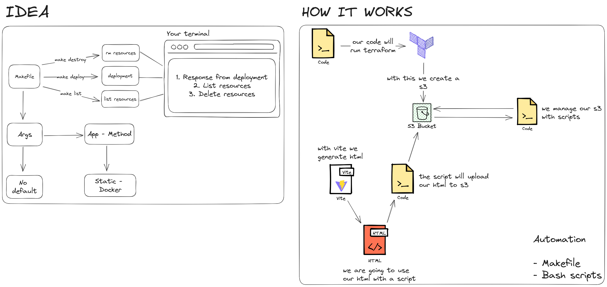

# Easy Static - A simple static site deployment tool

Manage your static site with ease. Easy Static is a simple static site deployment tool that allows you to deploy your static site to multiple hosts with a single command.



## Software requirements 📦

- [Ansible](https://docs.ansible.com/ansible/latest/installation_guide/intro_installation.html)
- [Terraform](https://learn.hashicorp.com/tutorials/terraform/install-cli)
- [AWS CLI](https://docs.aws.amazon.com/cli/latest/userguide/install-cliv2.html)
- [jq](https://stedolan.github.io/jq/download/)
- [pip](https://pip.pypa.io/en/stable/installing/)

## File structure 📁

```
🌳 easy-static/
┣ 📁 ansible/
┃ ┣ 📁 files/
┃ ┃ ┗ 📄 .gitkeep
┃ ┣ 📁 inventory/
┃ ┃ ┗ 📄 .gitkeep
┃ ┣ 📁 playbook/
┃ ┃ ┗ 📄 .gitkeep
┃ ┗ 📄 .gitkeep
┣ 📁 app/
┃ ┗ 📁 Boilerplate/
┣ 📁 design/
┃ ┣ 📄 .gitkeep
┃ ┗ 📄 easy-static-new.png
┣ 📁 docs/
┃ ┗ 📄 .gitkeep
┣ 📁 scripts/
┃ ┣ 📄 .gitkeep
┃ ┣ 📄 install-ansible.sh
┃ ┣ 📄 install-docker.sh
┃ ┣ 📄 install-terraform.sh
┃ ┣ 📄 run.sh
┃ ┗ 📄 s3-action.sh
┣ 📁 terraform/
┃ ┣ 📁 .terraform/
┃ ┃ ┣ 📁 modules/
┃ ┃ ┃ ┗ 📄 modules.json
┃ ┃ ┗ 📁 providers/
┃ ┃   ┗ 📁 registry.terraform.io/
┃ ┃ ┃   ┗ 📁 hashicorp/
┃ ┣ 📁 config/
┃ ┃ ┣ 📄 dev.tfvars
┃ ┃ ┗ 📄 prod.tfvars
┃ ┣ 📁 modules/
┃ ┃ ┗ 📁 s3/
┃ ┃   ┣ 📄 output.tf
┃ ┃   ┣ 📄 provider.tf
┃ ┃   ┣ 📄 resources.tf
┃ ┃   ┗ 📄 variables.tf
┃ ┣ 📄 .gitkeep
┃ ┣ 📄 .terraform.lock.hcl
┃ ┣ 📄 main.tf
┃ ┣ 📄 terraform.tfstate
┃ ┣ 📄 terraform.tfstate.backup
┃ ┗ 📄 versions.tf
┣ 📄 .gitignore
┣ 📄 .gitmodules
┣ 📄 Makefile
┗ 📄 README.md
```